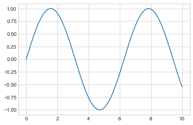
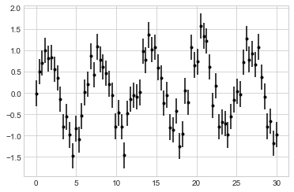
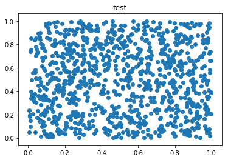

常用的引用：numpy;  matplotlib.pyplot;  pandas

蒙提霍尔问题/三门问题（Monty Hall problem）.
该游戏涉及一个针对玩家的主持人，玩家位于三个门前，其中一个门后面是一辆车，其余门后面都是山羊。首先，玩家必须指明一扇门；然后主持人必须打开一扇门，既不是玩家选择的门也不是隐藏汽车的门；最后，玩家选择打开，最初选择的门还是剩下的第三个门。

设置工作区


```python
%matplotlib inline
```


```python
from random import randint, seed
```


```python
from enum import Enum
```


```python
import matplotlib.pyplot as plt
```


```python
class Strategy(Enum):
    CHANGE = 1 #改变最初选择
    KEEP = 2 #坚持最初选择
```


```python
seed()

def Hall_game(straregy):
    doors = [0, 1, 2]; #三个门
    good_door = randint(0, 2)  #在0到2范围内随机生成一个整数，作为有车的那个门号
    
    #玩家的选择
    first_choice = randint(0, 2)
    
    #剩下的两个门
    doors.remove(first_choice)
    
    #主持人选择的门
    if first_choice == good_door:
        doors.remove(doors[randint(0,1)])
    else:
        doors = [good_door]
    
    second_choice = 0    
    if straregy == Strategy.CHANGE:
        second_choice = doors[0]
    elif straregy == Strategy.KEEP:
        second_choice = first_choice
    else:
        raise ValueError("Strategy not recognized")
    
    return second_choice == good_door
                           
```


```python
strategy = Strategy.CHANGE
Hall_game(strategy)
```


    False


三元运算符:
condition_is_true if condition else condition_is_false

 列表推导式: variable = [ out_exp for out_exp in input_list if out_exp == 2 ]


```python
def Play(strategy, nb_turns):
    return [1 if Hall_game(strategy) else 0 for i in range(nb_turns)] 
```


```python
print("By changing doors, the player has won {} on 10,000 games.".format(sum(Play(Strategy.CHANGE, 10000))))
print("By keeping his initial choice, the player has won {} out of 10,000 games.".format(sum(Play(Strategy.KEEP,10000))))
```

    By changing doors, the player has won 6745 on 10,000 games.
    By keeping his initial choice, the player has won 3361 out of 10,000 games.
    

使用Numpy和Matplotlib操作数据. 

Numpy（Numerical Python）提供了一个存储和处理数据的接口.
Numpy数组就像Python列表，但是Numpy可以让事情变得更有效率，特别是对于更大的数组.


```python
import numpy as np
```

和Python列表不同，Numpy数组只能包含一种类型的成员，有几种方法可以在Numpy中创建数组：


```python
ar = np.array([1, 2, 3])
ar
```


    array([1, 2, 3])


```python
print(ar) #输出的是数组，不是列表，T眉头逗号哦！！ 此处是3行一列的一维数组
```

    [1 2 3]
    

如果初始化列表中有不同类型的数据，Numpy会尝试把它们全部转化为最通用的类型。例如，整数int将转化为float类型


```python
np.array([3.1, 4, 5, 6])
```


    array([3.1, 4. , 5. , 6. ])


也可以手动设置类型


```python
np.array([1, 2, 3], dtype = 'float32')
```


    array([1., 2., 3.], dtype=float32)


用 array（） 函数创建数组时，里面可以列表、元组或者它们的组合，最后都会变成数组


```python
arr1 = np.array(range(5)) #整型
arr2 = np.array([1.2,3.4,5.6]) #浮点
arr3 = np.array([[1,2,3],('a','b','c')]) #既有列表又有元组，且元素个数相同，最终各自包含每个元素都是变为结果数组中每个数组元素，且类型一致
arr4 = np.array([[1,2,3],('a','b','c','d')]) #列表和元组内元素个数不同，相当于数组里有两个元素，列表和元组
print(arr1, type(arr1), arr1.dtype)
print(arr2, type(arr2), arr2.dtype)
print(arr3, arr3.shape, arr3.ndim, arr3.size, arr3.dtype)# 数组、结构、维度、大小、类型
print(arr4, arr4.shape, arr4.ndim, arr4.size, arr4.dtype)
```

    [0 1 2 3 4] <class 'numpy.ndarray'> int32
    [1.2 3.4 5.6] <class 'numpy.ndarray'> float64
    [['1' '2' '3']
     ['a' 'b' 'c']] (2, 3) 2 6 <U11
    [list([1, 2, 3]) ('a', 'b', 'c', 'd')] (2,) 1 2 object
    

数组的转置


```python
yw = np.array([1,2,3]) #一维数组转置是不变的
print(yw, yw.shape, yw.ndim)
ywT = yw.T
print(ywT, ywT.shape, ywT.ndim)
ew = np.array([[1,2],[3,4],[5,6]])
print(ew, ew.shape, ew.ndim)
ewT = ew.T
print(ewT, ewT.shape, ewT.ndim)
```

    [1 2 3] (3,) 1
    [1 2 3] (3,) 1
    [[1 2]
     [3 4]
     [5 6]] (3, 2) 2
    [[1 3 5]
     [2 4 6]] (2, 3) 2
    

可以连接两个或多个数组


```python
a = np.array([1, 2, 3])
b = np.array([3, 2, 1])
c = np.array([7, 8, 9])
np.concatenate([a, b, c])
```


    array([1, 2, 3, 3, 2, 1, 7, 8, 9])


Numpy有几个函数，可以直接创建数组，对于大型数组的创建时很有效的


```python
np.empty(5)
```


    array([0.2, 0.4, 0.6, 0.8, 1. ])


```python
np.zeros(10, dtype = int)
```


    array([0, 0, 0, 0, 0, 0, 0, 0, 0, 0])


```python
np.ones((3, 5), dtype = float)
```


    array([[1., 1., 1., 1., 1.],
           [1., 1., 1., 1., 1.],
           [1., 1., 1., 1., 1.]])


```python
np.full((3, 5), 3.14)
```


    array([[3.14, 3.14, 3.14, 3.14, 3.14],
           [3.14, 3.14, 3.14, 3.14, 3.14],
           [3.14, 3.14, 3.14, 3.14, 3.14]])


```python
np.arange(0, 20, 2) #[0,20) 间隔是2
```


    array([ 0,  2,  4,  6,  8, 10, 12, 14, 16, 18])


```python
np.linspace(0, 1, 5) #[0,1] 5个数
```


    array([0.  , 0.25, 0.5 , 0.75, 1.  ])


```python
np.linspace(0, 1, 7)
```


    array([0.        , 0.16666667, 0.33333333, 0.5       , 0.66666667,
           0.83333333, 1.        ])


```python
np.eye(3)
```


    array([[1., 0., 0.],
           [0., 1., 0.],
           [0., 0., 1.]])


```python
np.eye(4)
```


    array([[1., 0., 0., 0.],
           [0., 1., 0., 0.],
           [0., 0., 1., 0.],
           [0., 0., 0., 1.]])


每个Numpy数组都有一些比较通用的属性

numpy.random.randint(low,high=None,size=None,dtype) . 
生成在半开半闭区间[low,high)上离散均匀分布的整数值;若high=None，则取值区间变为[0,low) 


```python
np.random.seed(0) #如果不设置seed的值，每次就会生成不同的随机数，设置了之后就是生成相同的随机数了，而且这个值是起始值
x1 = np.random.randint(10, size = 6)
print("数组x1：",x1)
print("数组x1的维度：",x1.ndim)
print("数组x1的结构（就是几行几列）：", x1.shape)
print("数组x1的元素个数：", x1.size)
print("数组的元素类型：", x1.dtype)
```

    数组x1： [5 0 3 3 7 9]
    数组x1的维度： 1
    数组x1的结构（就是几行几列）： (6,)
    数组x1的元素个数： 6
    数组的元素类型： int32
    

经常需要访问数组的一个或者多个元素


```python
print(x1[0])
```

    5
    


```python
print(x1[-1]) #-1指的最后一个元素
```

    9
    


```python
print(x1[-2]) #-2指的倒数第二个元素，以此类推，就x1来说，-7开始就不行了
```

    7
    


```python
x2 = np.random.randint(10, size=(3, 4))
print(x2)
```

    [[3 5 2 4]
     [7 6 8 8]
     [1 6 7 7]]
    


```python
print(x2[0,1])
```

    5
    


```python
x1[1] = 3.14 #都变成int32类型
print(x1)
```

    [5 3 3 3 7 9]
    


```python
print(x1[0:5])
```

    [5 3 3 3 7]
    


```python
print(x1[:5])
```

    [5 3 3 3 7]
    


```python
print(x1[5:])
```

    [9]
    


```python
print(x1[::2]) #每两个输出一次
```

    [5 3 7]
    


```python
print(x2[0:])
```

    [[3 5 2 4]
     [7 6 8 8]
     [1 6 7 7]]
    


```python
print(x2[0:1])
```


```python
print(x2[:,1]) #取第一列
```

    [5 6 6]
    


```python
print(x2[0:2,2]) #第0行和第1行的第2列
```

    [2 8]
    

使用Numpy定义


```python
def reverse_calculation(values):
    output = np.empty(len(values))
    for i in range(len(values)):
        output[i] = 1.0/values[i]
    return output

values = np.random.randint(1, 10, size = 5)
print(reverse_calculation(values))
```

    [0.11111111 0.5        0.16666667 0.11111111 0.2       ]
    


```python
x = np.arange(4)
print("x = ", x)
```

    x =  [0 1 2 3]
    


```python
print("x + 5 = ", x + 5)
```

    x + 5 =  [5 6 7 8]
    


```python
print("x - 5 = ", x - 5)
```

    x - 5 =  [-5 -4 -3 -2]
    


```python
print("x * 2 = ", x * 2)
```

    x * 2 =  [0 2 4 6]
    


```python
print("x / 2 = ", x / 2)
```

    x / 2 =  [0.  0.5 1.  1.5]
    


```python
print("x // 2 = ", x // 2)
```

    x // 2 =  [0 0 1 1]
    


```python
xx = np.full((2, 3), 3)
print("xx = ", xx)
```

    xx =  [[3 3 3]
     [3 3 3]]
    


```python
print("xx + 5 = ", xx + 5)
```

    xx + 5 =  [[8 8 8]
     [8 8 8]]
    


```python
x = [-6, -3, 2, 5]
print("x = ", x)
print("取绝对值：", np.abs(x))
```

    x =  [-6, -3, 2, 5]
    取绝对值： [6 3 2 5]
    


```python
print("求指数：", np.exp(x)) #e的几次方
```

    求指数： [2.47875218e-03 4.97870684e-02 7.38905610e+00 1.48413159e+02]
    


```python
print("求对数：", np.log(np.abs(x))) #求以e为底的对数,也可以指明以谁为底：log10这样
```

    求对数： [1.79175947 1.09861229 0.69314718 1.60943791]
    


```python
x = np.random.rand(4,4) 
print("x = ", x)
```

    x =  [[0.31542835 0.36371077 0.57019677 0.43860151]
     [0.98837384 0.10204481 0.20887676 0.16130952]
     [0.65310833 0.2532916  0.46631077 0.24442559]
     [0.15896958 0.11037514 0.65632959 0.13818295]]
    


```python
x > 0.7
```


    array([[False, False, False, False],
           [ True, False, False, False],
           [False, False, False, False],
           [False, False, False, False]])


```python
x = np.random.randint(10, size = 5)
print("x = ", x)
```

    x =  [1 2 4 2 0]
    


```python
x > 2
```


    array([False, False,  True, False, False])


Numpy的运算

点积运算


```python
xar = np.array([[1,2],[3,4]])
yar = np.array([[5,6],[7,8]])
v = np.array([9,10])
w = np.array([11,12])
```


```python
# 9x11 + 10x12 = 219
print(v.dot(w))
print(np.dot(v, w))
```

    219
    219
    


```python
# 就是矩阵的相乘运算
print(xar.dot(yar))
print(np.dot(xar, yar))
```

    [[19 22]
     [43 50]]
    [[19 22]
     [43 50]]
    

求和运算


```python
xxAr = np.array([[1,2],[3,4]])
print(np.sum(xxAr)) #默认求和 把所有的元素都加起来
print(np.sum(xxAr, axis=0)) #=0的时候，计算每列的和
print(np.sum(xxAr, axis=1)) #=1的时候，计算每行的和
```

    10
    [4 6]
    [3 7]
    

使用Matplotlib处理数据. 
使用matplotlib主要是为了直接从Python生成图形


```python
plt.style.use('seaborn-whitegrid') #设置画图风格
```

绘制一个sin曲线


```python
fig = plt.figure() #画板
ax = plt.axes() #画纸    xAxis和yAxis是坐标系
x = np.linspace(0, 10, 1000)
ax.plot(x, np.sin(x))
```


    [<matplotlib.lines.Line2D at 0x52968d0>]





在离散数据集（点）的情况下，我们经常使用误差线来表示每个点的不确定性，以确定其准确值


```python
x = np.linspace(0, 30, 80)
dy = 0.3
y = np.sin(x) + dy * np.random.randn(80)

plt.errorbar(x, y, yerr = dy, fmt = '.k')
```


    <ErrorbarContainer object of 3 artists>





绘制散点图


```python
import matplotlib.pyplot as plt
sample1 = np.random.rand(1000)
sample2 = np.random.rand(1000)
plt.scatter(sample1,sample2) #绘制散点图
plt.title('test')
plt.show()
```





Pandas库是Python中数据科学的基本库之一。Pandas提供易于使用且功能强大的数据结构以及快速使用它们的方法。

pandas可用numpy数组表示


```python
import numpy as np
panda_numpy = np.array([200, 50, 100, 80])
panda_numpy
```


    array([200,  50, 100,  80])


```python
family = [
    np.array([100, 5, 20, 80]), #mom
    np.array([50, 2.5, 10, 40]), #baby
    np.array([110, 6, 22, 80]) #daddy
]
```

可用于表示数组的对象是DataFrame对象


```python
import pandas as pd
family_df = pd.DataFrame(family)
family_df
```


<div>
<style scoped>
    .dataframe tbody tr th:only-of-type {
        vertical-align: middle;
    }

    .dataframe tbody tr th {
        vertical-align: top;
    }

    .dataframe thead th {
        text-align: right;
    }
</style>
<table border="1" class="dataframe">
  <thead>
    <tr style="text-align: right;">
      <th></th>
      <th>0</th>
      <th>1</th>
      <th>2</th>
      <th>3</th>
    </tr>
  </thead>
  <tbody>
    <tr>
      <th>0</th>
      <td>100.0</td>
      <td>5.0</td>
      <td>20.0</td>
      <td>80.0</td>
    </tr>
    <tr>
      <th>1</th>
      <td>50.0</td>
      <td>2.5</td>
      <td>10.0</td>
      <td>40.0</td>
    </tr>
    <tr>
      <th>2</th>
      <td>110.0</td>
      <td>6.0</td>
      <td>22.0</td>
      <td>80.0</td>
    </tr>
  </tbody>
</table>
</div>


```python
family_df = pd.DataFrame(family,
                        index = ['mom', 'baby', 'dad'],
                        columns = ['legs', 'hair', 'hands', 'belly'])
family_df
```


<div>
<style scoped>
    .dataframe tbody tr th:only-of-type {
        vertical-align: middle;
    }

    .dataframe tbody tr th {
        vertical-align: top;
    }

    .dataframe thead th {
        text-align: right;
    }
</style>
<table border="1" class="dataframe">
  <thead>
    <tr style="text-align: right;">
      <th></th>
      <th>legs</th>
      <th>hair</th>
      <th>hands</th>
      <th>belly</th>
    </tr>
  </thead>
  <tbody>
    <tr>
      <th>mom</th>
      <td>100.0</td>
      <td>5.0</td>
      <td>20.0</td>
      <td>80.0</td>
    </tr>
    <tr>
      <th>baby</th>
      <td>50.0</td>
      <td>2.5</td>
      <td>10.0</td>
      <td>40.0</td>
    </tr>
    <tr>
      <th>dad</th>
      <td>110.0</td>
      <td>6.0</td>
      <td>22.0</td>
      <td>80.0</td>
    </tr>
  </tbody>
</table>
</div>


DataFrame的一些小功能

访问数组的某一列


```python
family_df.belly
family_df["belly"]
```


    mom     80.0
    baby    40.0
    dad     80.0
    Name: belly, dtype: float64


访问某一行


```python
family_df.loc["mom"]
```


    legs     100.0
    hair       5.0
    hands     20.0
    belly     80.0
    Name: mom, dtype: float64


```python
family_df.loc["baby", ["legs", "hair"]] #baby行的 legs和hair列
```


    legs    50.0
    hair     2.5
    Name: baby, dtype: float64


```python
family_df.loc[:, ["hands"]] #所有行的hands列
```


<div>
<style scoped>
    .dataframe tbody tr th:only-of-type {
        vertical-align: middle;
    }

    .dataframe tbody tr th {
        vertical-align: top;
    }

    .dataframe thead th {
        text-align: right;
    }
</style>
<table border="1" class="dataframe">
  <thead>
    <tr style="text-align: right;">
      <th></th>
      <th>hands</th>
    </tr>
  </thead>
  <tbody>
    <tr>
      <th>mom</th>
      <td>20.0</td>
    </tr>
    <tr>
      <th>baby</th>
      <td>10.0</td>
    </tr>
    <tr>
      <th>dad</th>
      <td>22.0</td>
    </tr>
  </tbody>
</table>
</div>


通过行号进行索引


```python
family_df.iloc[0:] #索引所有行
```


<div>
<style scoped>
    .dataframe tbody tr th:only-of-type {
        vertical-align: middle;
    }

    .dataframe tbody tr th {
        vertical-align: top;
    }

    .dataframe thead th {
        text-align: right;
    }
</style>
<table border="1" class="dataframe">
  <thead>
    <tr style="text-align: right;">
      <th></th>
      <th>legs</th>
      <th>hair</th>
      <th>hands</th>
      <th>belly</th>
    </tr>
  </thead>
  <tbody>
    <tr>
      <th>mom</th>
      <td>100.0</td>
      <td>5.0</td>
      <td>20.0</td>
      <td>80.0</td>
    </tr>
    <tr>
      <th>baby</th>
      <td>50.0</td>
      <td>2.5</td>
      <td>10.0</td>
      <td>40.0</td>
    </tr>
    <tr>
      <th>dad</th>
      <td>110.0</td>
      <td>6.0</td>
      <td>22.0</td>
      <td>80.0</td>
    </tr>
  </tbody>
</table>
</div>


```python
family_df.iloc[:, [1]] #索引所有行的第2列
```


<div>
<style scoped>
    .dataframe tbody tr th:only-of-type {
        vertical-align: middle;
    }

    .dataframe tbody tr th {
        vertical-align: top;
    }

    .dataframe thead th {
        text-align: right;
    }
</style>
<table border="1" class="dataframe">
  <thead>
    <tr style="text-align: right;">
      <th></th>
      <th>hair</th>
    </tr>
  </thead>
  <tbody>
    <tr>
      <th>mom</th>
      <td>5.0</td>
    </tr>
    <tr>
      <th>baby</th>
      <td>2.5</td>
    </tr>
    <tr>
      <th>dad</th>
      <td>6.0</td>
    </tr>
  </tbody>
</table>
</div>


通过iterrows 返回一个元祖，遍历整个元组的内容


```python
for ind, content in family_df.iterrows():
    print("Family:  %s:" %ind)
    print(content)
```

    Family:  mom:
    legs     100.0
    hair       5.0
    hands     20.0
    belly     80.0
    Name: mom, dtype: float64
    Family:  baby:
    legs     50.0
    hair      2.5
    hands    10.0
    belly    40.0
    Name: baby, dtype: float64
    Family:  dad:
    legs     110.0
    hair       6.0
    hands     22.0
    belly     80.0
    Name: dad, dtype: float64
    

创建一个CSV文件


```python
%%writefile dataset.csv

n1, n2, n3, n4, n5
10, 20, NaN, 40, Yes
b1, 25, 35, 45, No
18, 28, 38, 48, No
```

    Overwriting dataset.csv
    

Pandas库是指向数组操作的指针。因此，可以用Pandas读取CSV文件：从CSV创建数据框只需要一行

data变量现在包含一个包含csv文件数据的数据帧；
csv文件中的值室友符号 ; 分隔的；
默认情况下，pd.read_csv期望以逗号分隔的值


```python
data = pd.read_csv("dataset.csv")
```


```python
data
```


<div>
<style scoped>
    .dataframe tbody tr th:only-of-type {
        vertical-align: middle;
    }

    .dataframe tbody tr th {
        vertical-align: top;
    }

    .dataframe thead th {
        text-align: right;
    }
</style>
<table border="1" class="dataframe">
  <thead>
    <tr style="text-align: right;">
      <th></th>
      <th>n1</th>
      <th>n2</th>
      <th>n3</th>
      <th>n4</th>
      <th>n5</th>
    </tr>
  </thead>
  <tbody>
    <tr>
      <th>0</th>
      <td>10</td>
      <td>20</td>
      <td>NaN</td>
      <td>40</td>
      <td>Yes</td>
    </tr>
    <tr>
      <th>1</th>
      <td>b1</td>
      <td>25</td>
      <td>35</td>
      <td>45</td>
      <td>No</td>
    </tr>
    <tr>
      <th>2</th>
      <td>18</td>
      <td>28</td>
      <td>38</td>
      <td>48</td>
      <td>No</td>
    </tr>
  </tbody>
</table>
</div>


```python
X = data.iloc[:, 4].values
Y = data.iloc[:, 1:3].values
print("X")
print(X)
print("Y")
print(Y)
```

    X
    [' Yes' ' No' ' No']
    Y
    [[20 ' NaN']
     [25 ' 35']
     [28 ' 38']]
    

处理丢失的数据。用整列的平均值或者中间值替换丢失的数据。用sklearn.preprocessing库中的Imputer类完成这项任务


```python
from sklearn.preprocessing import Imputer
# axis = 0 表示按列进行
imputer = Imputer(missing_values = "NaN", strategy = "mean", axis = 0)
imputer = imputer.fit(Y[:,1:3])
Y[:,1:3] = imputer.transform(Y[:,1:3])
print("处理后的Y：")
print(Y)
```

    处理后的Y：
    [[20 36.5]
     [25 35.0]
     [28 38.0]]
    

解析分类数据

分类数据是指含有标签值而不是数字值的变量，取值范围通常是固定的。例如“Yes”和“No”不能用于模型的数学计算，所以需要解析成数字。为实现这一功能，从sklearn.preprocessing库导入LabelEncoder类


```python
from sklearn.preprocessing import LabelEncoder, OneHotEncoder
labelencoder_X = LabelEncoder()
X = labelencoder_X.fit_transform(X)
print("处理过的X：")
print(X)
```

    处理过的X：
    [1 0 0]
    

拆分数据集为测试集合和训练集合

把数据集拆成两个：一个是用来训练模型的训练集合，另一个是用来验证模型的测试集合。两者比例一般是80:20，导入sklearn.model_selection库中的train_test_split()方法


```python
from sklearn.model_selection import train_test_split
X_train, X_test, Y_train, Y_test = train_test_split(X, Y, test_size = 0.2, random_state = 0)
print("X_train: ")
print(X_train)
print("X_test: ")
print(X_test)
print("Y_train: ")
print(Y_train)
print("Y_test: ")
print(Y_test)
```

    X_train: 
    [0 1]
    X_test: 
    [0]
    Y_train: 
    [[25 35.0]
     [20 36.5]]
    Y_test: 
    [[28 38.0]]
    

特征量化

大部分模型算法使用两点间的欧式距离表示，但次特征在幅度、单位和范围姿态问题上变化很大。在距离计算中，高幅度的特征比低幅度的特征权重更大。可用特征标准化或Z值归一化解决。导入sklearn.processing库中的StandardScalar类。


```python
from sklearn.preprocessing import StandardScaler
sc_Y = StandardScaler()
Y_train = sc_Y.fit_transform(Y_train)
Y_test = sc_Y.fit_transform(Y_test)
print("Y_train")
print(Y_train)
print("Y_test")
print(Y_test)
```

    Y_train
    [[ 1. -1.]
     [-1.  1.]]
    Y_test
    [[0. 0.]]
    

    C:\Users\Administrator.PC-20180806IONF\Anaconda3\lib\site-packages\sklearn\utils\validation.py:475: DataConversionWarning: Data with input dtype object was converted to float64 by StandardScaler.
      warnings.warn(msg, DataConversionWarning)
    

图像操作:  from scipy.misc import imread, imsave， imresize被替换了  


```python
from imageio import imread, imwrite 
img = imread('C:/Users/Administrator.PC-20180806IONF/Pictures/girl.jpg')
print(img.dtype, img.shape)
```

    uint8 (492, 500, 3)
    


```python
from skimage.transform import resize
img_tinted = img * [1, 0.95, 0.9]
img_tinted = resize(img_tinted, (200,300))
imwrite('C:/Users/Administrator.PC-20180806IONF/Pictures/girl.jpg', img_tinted)
```

    C:\Users\Administrator.PC-20180806IONF\Anaconda3\lib\site-packages\skimage\transform\_warps.py:105: UserWarning: The default mode, 'constant', will be changed to 'reflect' in skimage 0.15.
      warn("The default mode, 'constant', will be changed to 'reflect' in "
    C:\Users\Administrator.PC-20180806IONF\Anaconda3\lib\site-packages\skimage\transform\_warps.py:110: UserWarning: Anti-aliasing will be enabled by default in skimage 0.15 to avoid aliasing artifacts when down-sampling images.
      warn("Anti-aliasing will be enabled by default in skimage 0.15 to "
    WARNING:root:Lossy conversion from float64 to uint8. Range [0.0, 255.0]. Convert image to uint8 prior to saving to suppress this warning.
    

点和点之间的关系


```python
from scipy.spatial.distance import pdist, squareform
x3 = np.array([[0,1], [1,0], [2,0]])
print(x3)
```

    [[0 1]
     [1 0]
     [2 0]]
    


```python
d = squareform(pdist(x3, 'euclidean')) #计算每个向量对的距离，并转为矩阵形式
print(d)
```

    [[0.         1.41421356 2.23606798]
     [1.41421356 0.         1.        ]
     [2.23606798 1.         0.        ]]
    


```python

```
